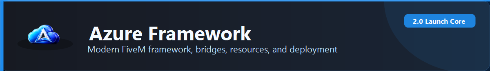
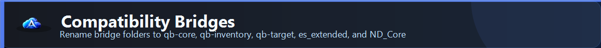
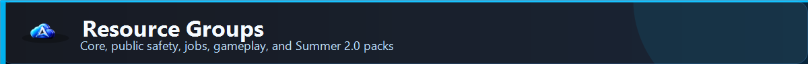
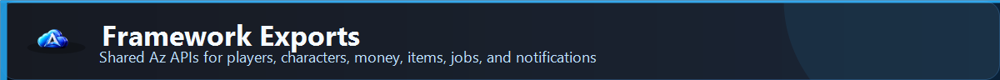
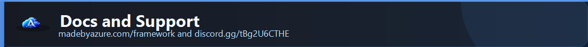

<p align="center">
  
</p>

<p align="center">
  <a href="https://madebyazure.com/framework/"></a>
  <a href="https://github.com/Azure-Framework/txRecipe"></a>
  <a href="https://discord.gg/tBg2U6CTHE"></a>
  <a href="https://github.com/Azure-Framework/Az-Framework"></a>
</p>

---

<p align="center">
  
</p>

## Az-Framework 2.0

Azure Framework is a modular FiveM ecosystem built around the `Az-Framework` core. It gives servers a central player, character, money, job, inventory bridge, admin, department, and export layer while still supporting resources made for QBCore, qb-inventory, qb-target, ESX, ND_Core, ox, and vMenu-style stacks.

Use it as a full framework, a hybrid vMenu/framework stack, or a compatibility base while moving older resources into Az-native logic.

## Why Servers Use Az

- One central framework resource instead of scattered standalone systems.
- Bridge exports for QBCore, qb-inventory, qb-target, ESX, and ND_Core compatibility.
- Built-in modules for character flow, admin tools, banking, jobs, departments, HUD, death, DMV, fuel, housing, insurance, and more.
- Summer 2.0 activity pack with legal jobs, illegal contracts, routing, rewards, cooldowns, validation, and dispatch hooks.
- txAdmin recipe for fast fresh installs.
- Public docs and Discord support.

---

<details open>
<summary><b>Start Here</b></summary>

Docs:

```text
https://madebyazure.com/framework/
```

Discord:

```text
https://discord.gg/tBg2U6CTHE
```

Fresh install:

```text
https://github.com/Azure-Framework/txRecipe
```

Core start order:

```cfg
ensure oxmysql
ensure ox_lib
ensure ox_target
ensure Az-Framework
```

Start inventory, targeting, bridges, MDT, jobs, and gameplay resources after `Az-Framework`.

</details>

<p align="center">
  
</p>

<details>
<summary><b>Bridge Rename Instructions</b></summary>

The bridge repos are Az-branded on GitHub, but the folders must use the original framework resource names at runtime. Many legacy resources check `GetResourceState()` or exports by exact resource name.

If you download bridges manually, rename them before starting the server:

| GitHub repository | Required folder name | Why |
| --- | --- | --- |
| `Az-QBCore-Bridge` | `qb-core` | Resources call `exports['qb-core']:GetCoreObject()` |
| `Az-QBInventory-Bridge` | `qb-inventory` | Resources expect qb-inventory events/exports |
| `Az-QBTarget-Bridge` | `qb-target` | Resources expect qb-target exports |
| `Az-ESX-Bridge` | `es_extended` | Resources expect ESX Legacy APIs |
| `Az-NDCore-Bridge` | `ND_Core` | Resources expect ND_Core APIs |

Correct bridge start order:

```cfg
ensure Az-Framework
ensure qb-core
ensure qb-inventory
ensure qb-target
ensure es_extended
ensure ND_Core
```

The txAdmin recipe already downloads the bridge repos and renames/moves them into the correct runtime folder names.

</details>

<p align="center">
  
</p>

<details>
<summary><b>Resource Groups</b></summary>

Core:

- `Az-Framework`
- `txRecipe`

Compatibility bridges:

- `Az-QBCore-Bridge`
- `Az-QBInventory-Bridge`
- `Az-QBTarget-Bridge`
- `Az-ESX-Bridge`
- `Az-NDCore-Bridge`

Summer 2.0:

- `Az-Summer2Core`
- `Az-Lifeguard`
- `Az-Marina`
- `Az-IceCream`
- `Az-Camping`
- `Az-ParkEvents`
- `Az-ResortStaff`
- `Az-FoodFestival`
- `Az-Fishing2`
- `Az-SmugglingRun`
- `Az-Boosting2`
- `Az-Burglary2`
- `Az-DrugLabs2`
- `Az-IllegalFishing`
- `Az-Poaching`
- `Az-ScrapTheft`
- `Az-FraudOps`
- `Az-StreetRacing2`
- `Az-BlackMarketBeach`

Public safety and server systems:

- `Az-MDT`
- `Az-5PD`
- `Az-Jailing`
- `Az-Ambulance`
- `Az-Fire`
- `Az-ParkRangers`
- `Az-Admin`
- `Az-ConfigManager`
- `Az-Loading`
- `Az-WeatherSystem`

Jobs, economy, and gameplay:

- `Az-Jobs`
- `Az-JobCenter`
- `Az-JobGarages`
- `Az-Marketplace`
- `Az-Hunting`
- `Az-Fishing`
- `Az-FishFinder`
- `Az-Inventory`
- `Az-Levels`
- `Az-Dealerships`
- `Az-VehicleSystems`

</details>

<p align="center">
  
</p>

<details>
<summary><b>Common Az Exports</b></summary>

```lua
local Az = exports['Az-Framework']:GetObject()
local player = exports['Az-Framework']:GetPlayer(source)
local snapshot = exports['Az-Framework']:GetBridgePlayerSnapshot(source)
```

```lua
exports['Az-Framework']:GetPlayer(source)
exports['Az-Framework']:GetPlayers()
exports['Az-Framework']:GetPlayerCharacter(source)
exports['Az-Framework']:GetActiveCharacter(source)
exports['Az-Framework']:GetBridgePlayerSnapshot(source)
exports['Az-Framework']:GetBridgePlayers()
exports['Az-Framework']:AddBridgeMoney(source, account, amount, reason)
exports['Az-Framework']:RemoveBridgeMoney(source, account, amount, reason)
exports['Az-Framework']:AddBridgeItem(source, item, count, metadata)
exports['Az-Framework']:RemoveBridgeItem(source, item, count, metadata)
exports['Az-Framework']:BridgeNotify(source, message, type, duration)
```

</details>

---

<p align="center">
  
</p>

## Links

- Docs: https://madebyazure.com/framework/
- Discord: https://discord.gg/tBg2U6CTHE
- Core repo: https://github.com/Azure-Framework/Az-Framework
- txAdmin recipe: https://github.com/Azure-Framework/txRecipe
